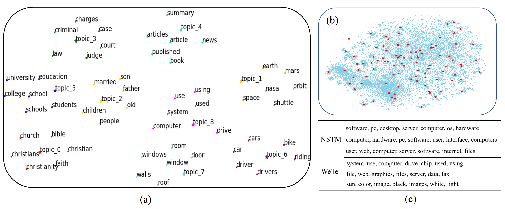

# WeTe: Representing mixtures of Word Embeddings with mixtures of Topic Embedding

This is the official implementation of our paper [Representing mixtures of Word Embeddings with mixtures of Topic Embedding](https://arxiv.org/abs/2203.01570)
in ICLR2022.



The proposed WeTe is a new topic modeling framework that views a document as a set of its word embeddings, and views topics as a set of embedding vectors shared over all documents.
Topic embeddings and the document proportions are learned by minimizing the bidirectional transport cost between those two sets.

## Getting Started
### Install
- Clone this repo:
```bash
git clone git@github.com:wds2014/WeTe.git
cd WeTe
```
- Install pytorch with cuda and other requirements as you need.

### Dataset
- Datasets in our paper

All datasets can be downloaded from [google driver](https://drive.google.com/drive/folders/1C2QTp1KMB131sp0XY8qXHILsJyvVF4T8?usp=sharing).
- Customising your own dataset

Organizing the Bow and the vocabulary of the corpus into the form WeTe expects according to the provided `.pkl` file in `dataset` folder and the `dataloader.py` file, and happy to try WeTe !

### Pretrained word embeddings
We recommend loading the pre-trained word embeddings for better results. 
- Glove

the pretrained glove word embeddings can be downloaded from [Glove](https://cdn-lfs.huggingface.co/stanfordnlp/glove/6471382cdd837544bf3ac72497a38715e845897d265b2b424b4761832009c837).
- Or, training (finetuning) the word embeddings for the corpus with word2vec tool.

### Training
- Easy to train:
```bash
python main.py
```
Changing the arguments in `main.py` for different datasets and settings. The learned topics are saved in `runs` folder.

### Evaluation
- Clustering and Classification

We have provided the K-means clustering and LogisticRegression classification codes in `cluster_clc.py` file. Those results are auto-reported during training.
- Topic quality

We have provided the topic diversity in `Trainer.py`. For topic coherence, please refer to [Palmetto](https://github.com/dice-group/Palmetto), which is not provided in this repo. One needs to download and set up separately.

## Citation
If you find this repo useful to your project, please consider to cite it with following bib:

```bash
@article{wang2022representing,
  title={Representing Mixtures of Word Embeddings with Mixtures of Topic Embeddings},
  author={Wang, Dongsheng and Guo, Dandan and Zhao, He and Zheng, Huangjie and Tanwisuth, Korawat and Chen, Bo and Zhou, Mingyuan},
  journal={arXiv preprint arXiv:2203.01570},
  year={2022}
}
```

